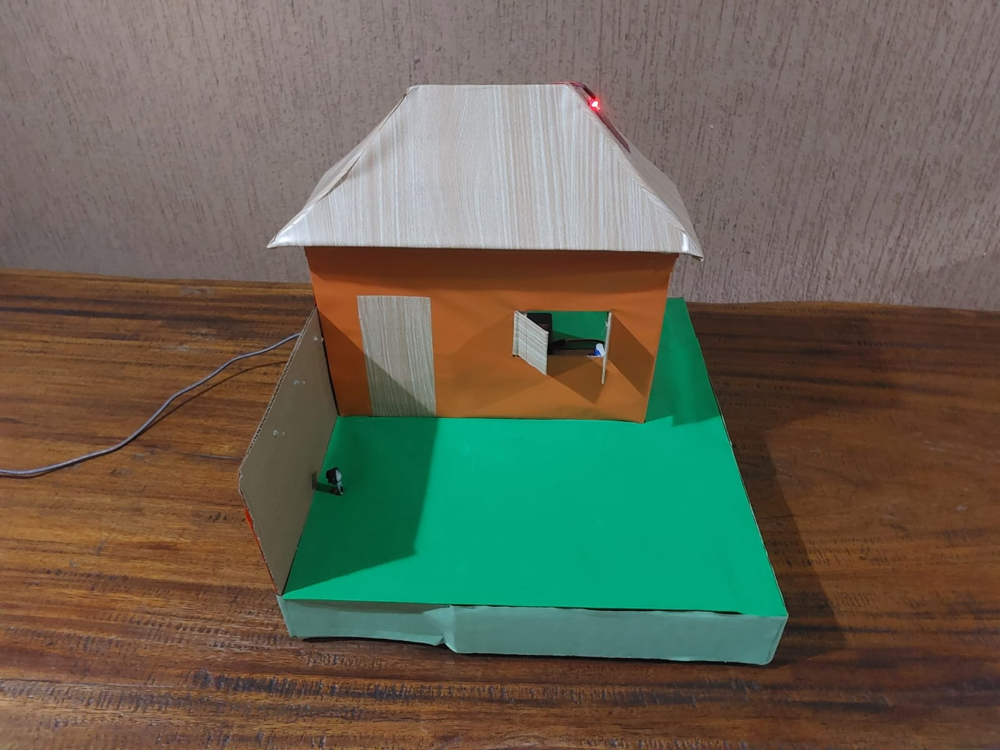
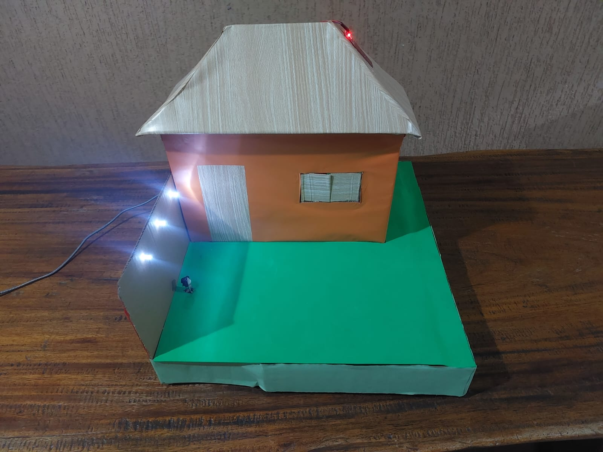
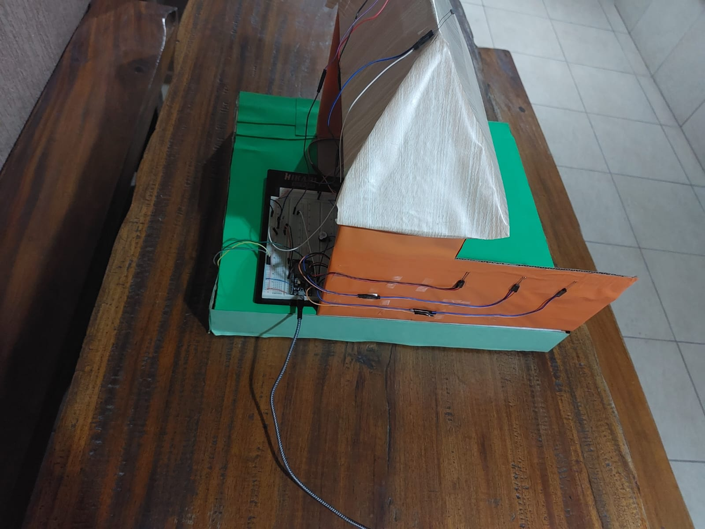
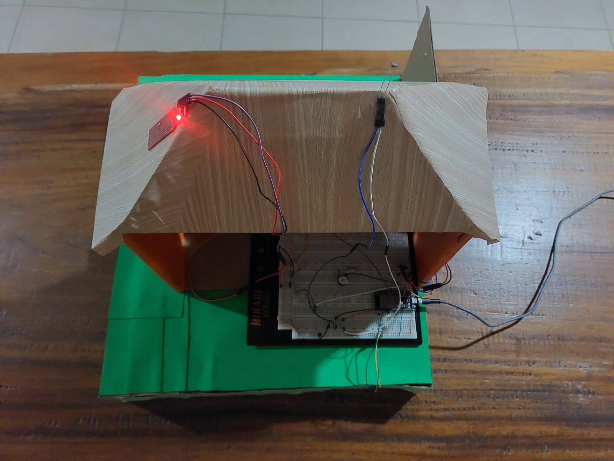
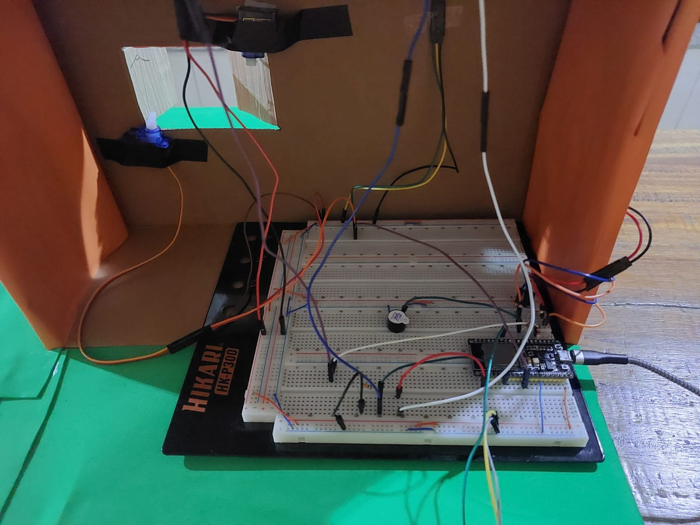
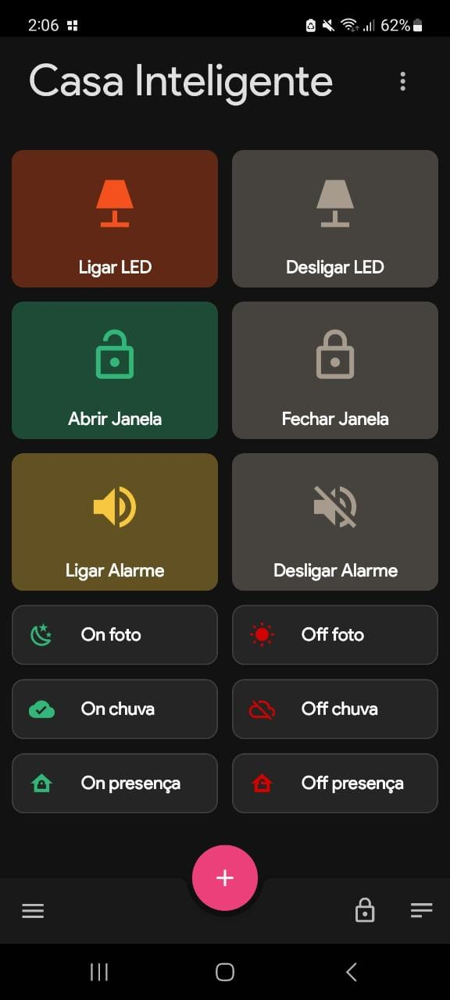

# Smart Home

O trabalho consiste em um modelo de casa que pode ser controlada por meio de um aplicativo, com a conexão sendo realizada pelo ESP32 utilizando o MQTT. A casa tem sensores que enviam dados para o ESP32, e de acordo com os dados recebidos, certas ações serão tomadas, como abrir ou fechar as janelas da casa, acender ou apagar as lâmpadas e ativar ou desativar o alarme de segurança.

## Motivação:
Criar um projeto que mostre a possibilidade de controlar uma casa por meio de uma conexão local.

## Objetivos:
Facilitar o controle de uma casa utilizando um celular para controlar sensores posicionados no ambiente, utilizando para isso o protocolo MQTT para enviar os dados para um banco de dados.

## Funcionamento:

- **Janela Inteligente:** Foi utilizado um sensor de umidade e 2 micro servos para fazer com que a janela feche caso o sensor seja molhado.

- **Lâmpada Inteligente:** Foi utilizado um sensor LDR (sensor de luminosidade) para que as luzes (leds) sejam acesas quando estiver escuro, e apagadas quando estiver claro. 

- **Alarme de segurança:** Foi utilizado um sensor de detecção de presença e um alarme (buzzer) para simular um alarme de segurança.

## Controle pelo app mobile
Através do celular é possível ativar ou desativar os sensores (chuva, luminosidade, presença), além de poder controlar independentemente os atuadores (janelas, luzes, alarme).

## [Video do Funcionamento](https://www.youtube.com/watch?v=jBRy-IZIT5E)

### Imagens adicionais:

  
  
  

  
  

### Imagem do app usado:

## Projeto:
Foi utilizado o broker MQTT Mosquitto para realizar a conexão entre a rede e o ESP32, para que o aplicativo consiga controlar o funcionamento dos sensores e atuadores conectados ao microcontrolador.

# Materiais/Custo:
Materiais | Custo | Quantidade
----------|-------|--------------
Sensor de Chuva/Nível de Água | R$ 13,36 | 1
Sensor Fotoresistor LDR | R$ 0,86 | 1
Mini sensor de movimento e presença PIR | R$ 15,86 | 1
Buzzer | R$ 2,76 | 1
Micro servo | R$ 23,66 | 2
LED (unidade) | R$ 0,28 | 3
Resistores (unidade) | R$ 1,90  | 5
Jumpers (conjunto) | R$ 6,56 | 3

# Ferramentas e recursos utilizados:

- MQTTBox: Aplicativo para computador utilizado para criar o cliente MQTT, visualizar os dados dos sensores e enviar comandos aos atuadores.

- MQTT Dashboard: Aplicativo mobile utilizado para controlar os sensores e atuadores.

- MySQL: Foi utilizado para guardar os dados obtidos dos sensores.

- Arduino IDE: IDE utilizada para escrever o código que controla o ESP32.

- Esp32: É uma placa de prototipação baseada em um microcontrolador. É o que controla todo o projeto, de acordo com o código feito.

- Protoboard: Utilizado para facilitar a montagem do projeto, os componentes foram ligados a ele.

- Resistores: Limita o fluxo de cargas elétricas entre os componentes.

- Sensor LDR: Utilizado para medir a luminosidade local.

- Sensor de água: Detecta a presença de água.

- Sensor PIR: Detecta movimento.

- Micro servo: Controla os movimentos da janela.

- Buzzer: Funciona como alarme.

- LED: Funciona como lâmpada.

# Conclusão:
Foi possível criar uma maquete que simula o funcionamento de uma casa inteligente, mostrando que é possível criar um sistema que controle por meio de sensores e atuadores,  janelas, lâmpadas e até mesmo criar um sistema de segurança para a casa. Sendo assim, é possível concluir que esta tecnologia é muito útil nos tempos atuais, aumentando a segurança e facilitando o cotidiano dos moradores.

